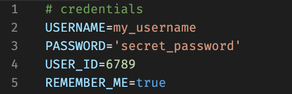
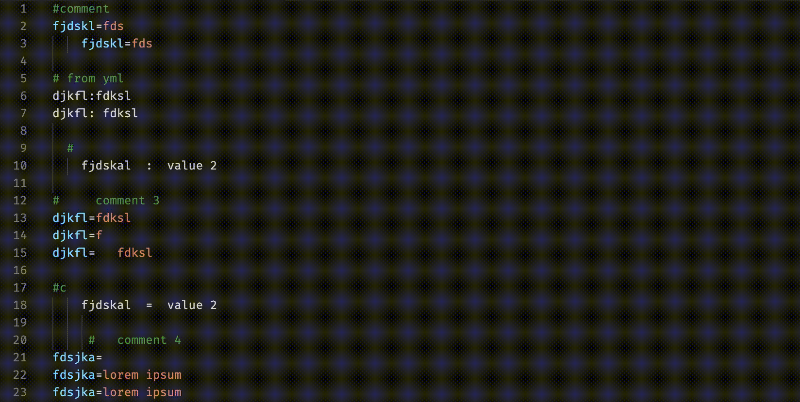
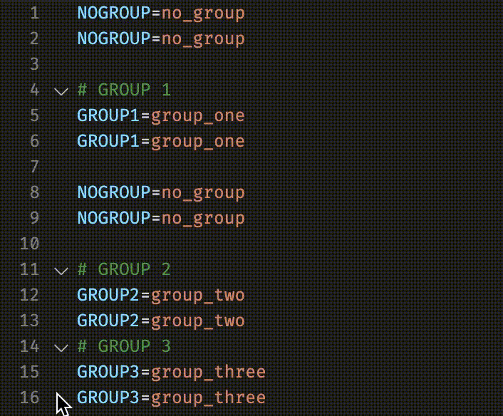
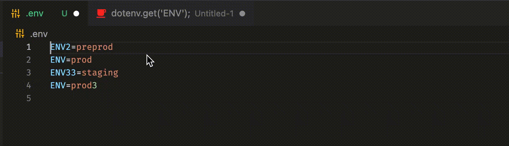
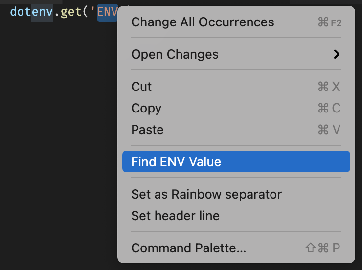
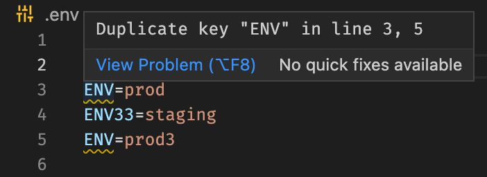

# EZ Env Variables

## Installation

This extension is not released to the marketplace yet. You can build the installer (.vsix) by running this command:

```bash
npm run release
```

## Features

* Syntax Highlighting

  

* Formatting

  Use `Format Document` command in the `Command Palette`. It will also transform YML syntax to Dotenv variables.

  

* Folding

  Folds your variables grouped by comments

  

* Find Variable Value

  Select a string and find its value in your `.env` file in the root project by using `Find ENV Value` command in the `Command Palette`

  

  ...or right click on the selection and choose `Find ENV Value`

  

* Show Duplicate Value

  

## Extension Support

The extension will support files with `.env` extension.

...or if you want your custom environment variables to use this extension, configure it in your [Language Identifiers settings](https://code.visualstudio.com/docs/languages/identifiers).

## Notes

If you have any problems or ideas, please open an issue! :)
